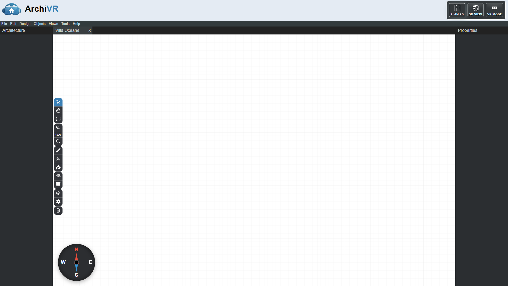
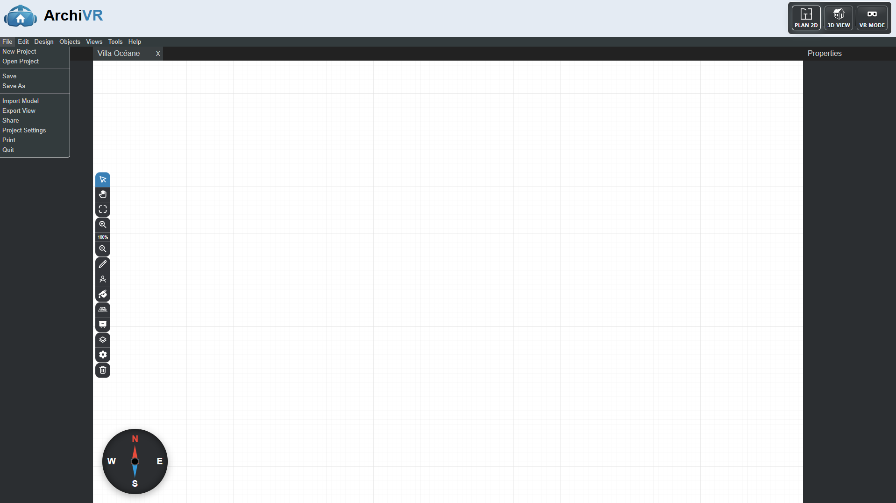
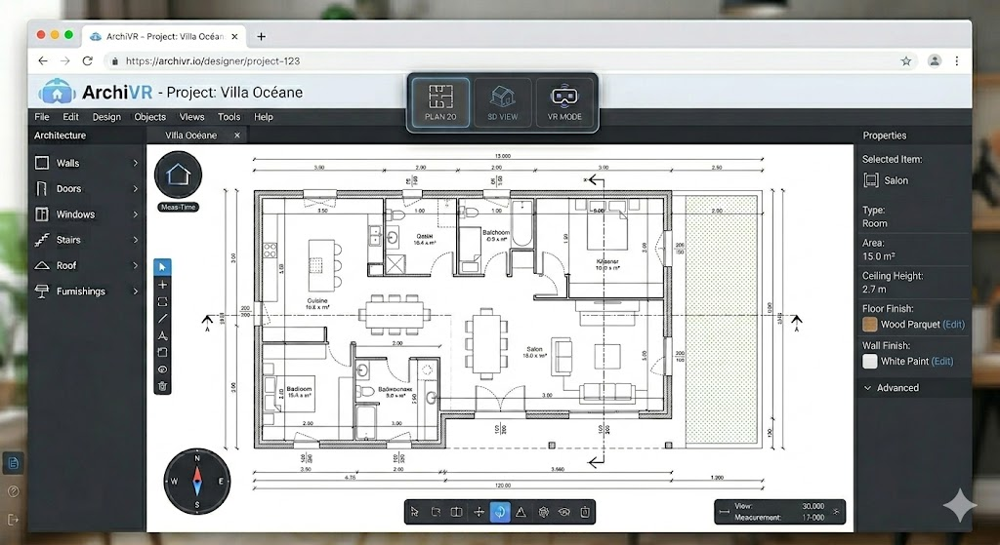
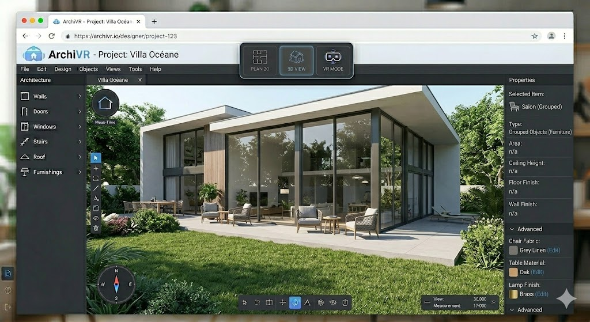

# Archi VR

Création d'une application d'architecture complète avec la spécificité qu'elle intègre une vue 3D ET une vue VR destiné aux client pour la visite immersive du batiment


## Run in local

### Via docker compose

```shell
docker compose up
```

### Via nodejs

```shell
npm run dev
```

## Run in production

```shell
docker compose -f docker-compose.prod.yml up
```


## For new design

- Go to http://localhost:3000/v2

**Actual available version**


**Actual available version with opened menu**


## Mock-ups

**2D PLAN View**


**3D View**
